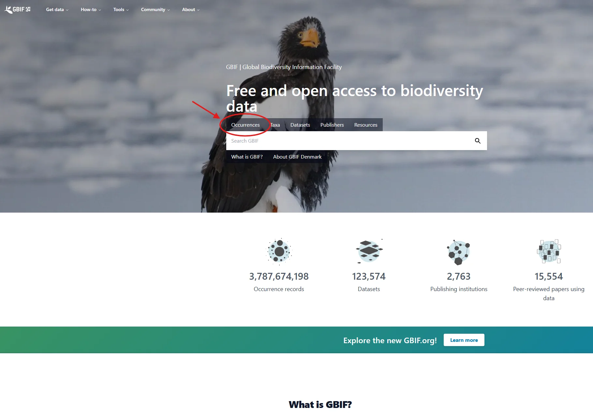
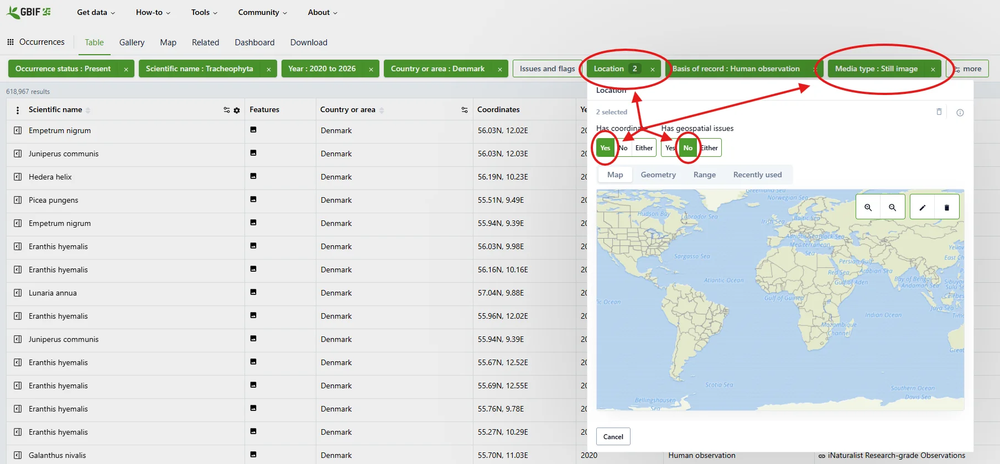
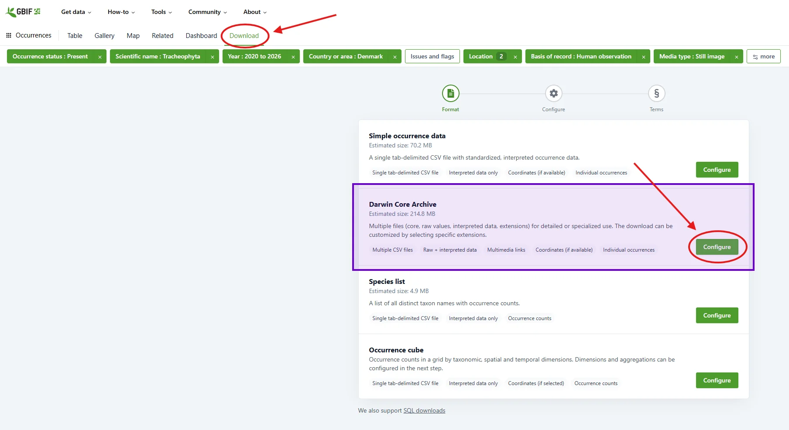
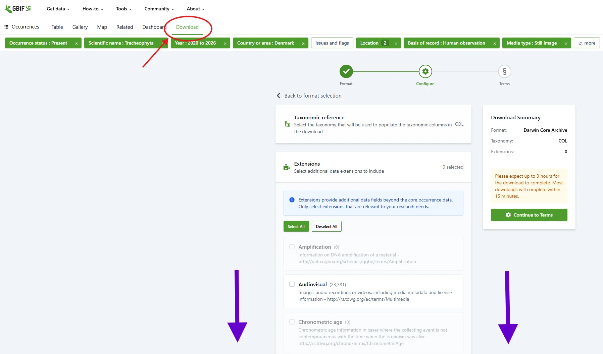
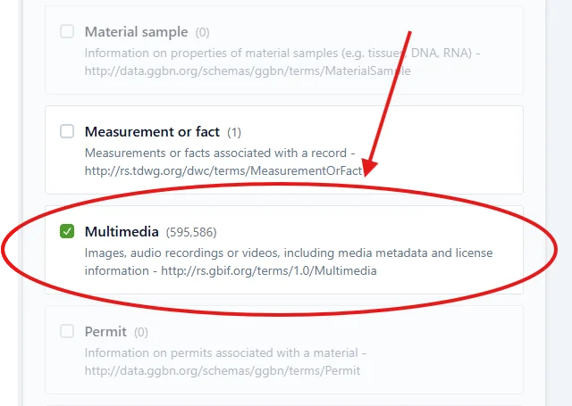
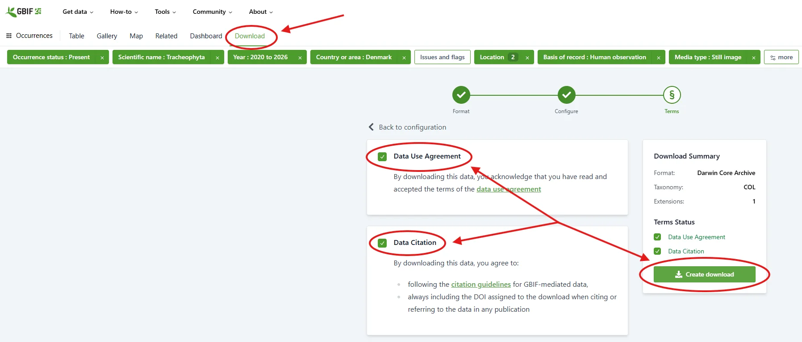
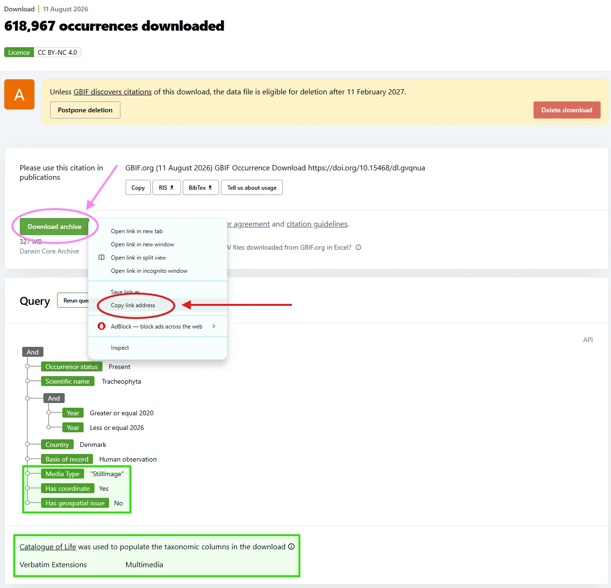
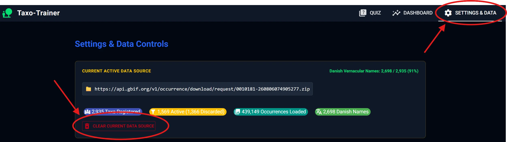
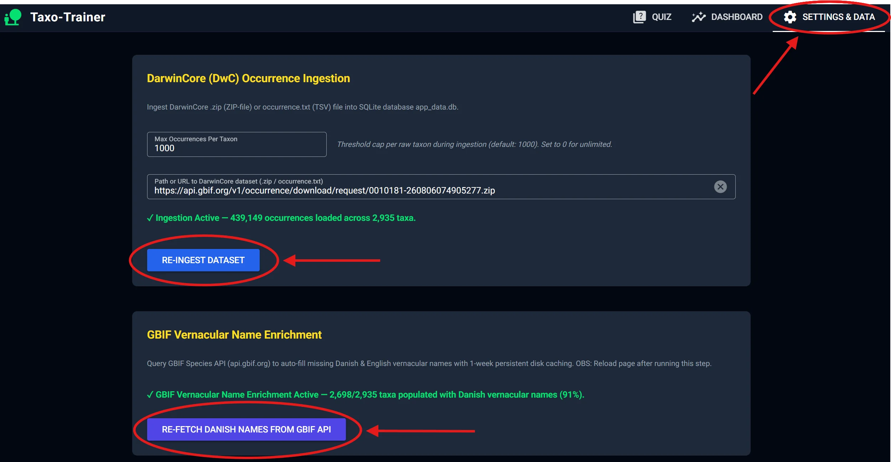

# `Taxo-Trainer`

`Taxo-Trainer` is a desktop web application for practicing plant and wildlife identification using GBIF DarwinCore occurrence datasets. It features interactive photo quiz workflows, multi-rank taxonomic validation, structured hints, dataset filtering, and detailed analytics.

_**Note**: `taxo-trainer` is built around a "bring-your-own" data model, so if you deploy the app or use it for other than personal use, you are responsible for complying with the relevant licenses, including the GBIF Data License (CC BY 4.0)._

---

## Features

### Quiz & Identification Interface
- **Photo Inspection Canvas**: High-resolution image viewer with keyboard-driven photo carousel (`Alt+Left` / `Alt+Right`), satellite map toggle (`Esri.WorldImagery`), observer attribution, and links to GBIF occurrence records.
- **Taxonomic Hierarchy Breakdown**: Visual hierarchy displaying Order, Family, Genus, and Species. Highlights correct rank matches, incorrect guesses, and unrevealed ranks.
- **Streak & Record Tracker**: Tracks active identification streaks (🔥) and personal best records (🏆) stored per dataset in SQLite.
- **Keyboard Shortcuts**:
  - `Ctrl + Right Arrow` or `n`: Advance to next observation
  - `Left / Right Arrow`: Navigate photo carousel
  - `Esc`: Clear / blur input box
  - `Enter`: Submit guess or select highlighted (top one is default selected) autocomplete candidate
  - Other shortcuts are currently undocumented

### Autocomplete & Name Validation
- **Multi-Word Per-Word Prefix Autocomplete**: Matches space-separated tokens as prefix filters across species, genus, and family names (e.g. typing `"alm fred"` matches `"Almindelig Fredløs"`).
- **Multi-Rank & Multi-Language Support**: Accepts guesses at any rank level (Family, Genus, Species) in scientific names or vernacular names across Danish, English, and 13+ supported languages.
- **Taxonomic Scope Interpolation**: Revealing or correctly guessing a higher rank (e.g. Family or Genus) automatically constrains autocomplete suggestions to taxa within that rank scope.

### Guided Hints & Assistance
- **Higher-Order Rank Hint**: Reveals the next unrevealed taxonomic rank (Order $\rightarrow$ Family $\rightarrow$ Genus $\rightarrow$ Species), updating the hierarchy display and scoping autocomplete choices.
- **1/5 Multiple Choice Hint**: Displays five candidate species choices strictly sampled from within the currently revealed taxonomic scope.
- **Unassisted Metric Enforcement**: Using any hint marks the attempt as assisted so it is excluded from unassisted accuracy metrics.

### Analytics & Mastery Dashboard
- **Time-Range Filters**: View performance statistics over 1 Hour, 24 Hours, 7 Days, 30 Days, 1 Year, or All Time.
- **Core Performance Metrics**: Tracks total attempts, unassisted accuracy percentage, active/best streaks, and mastered species counts ($\ge 90\%$ accuracy over $\ge 5$ attempts).
- **Family Mastery Breakdown**: Identifies highest-accuracy plant families and families requiring additional practice.
- **Trouble Taxa Table**: Highlights species with the lowest unassisted identification accuracy.
- **Taxonomic Confusion Matrix**: Logs pairwise misidentifications to highlight common lookalike species pairs.

### Dataset Ingestion & Filtering
- **Local File & Direct URL Ingestion**: Ingest DarwinCore archives from local `.zip` / `occurrence.txt` files or directly from GBIF HTTP(S) download URLs with automatic local caching and live progress updates.
- **GBIF Vernacular Name Enrichment**: Multithreaded lookup against the GBIF Species API to auto-fill missing vernacular names for taxa, genera, and families with disk caching.
- **Taxa Filtering**: Restrict training sessions to target families, genera, or species, or exclude non-native taxa.

### Interactive In-App Guides & Onboarding
- **Data-Driven Interactive Guides**: Built-in structured visual guides with annotated screenshots, step descriptions, and forward/backward navigation for initial dataset setup, custom GBIF dataset creation, and page walkthroughs (Quiz, Dashboard, Settings).
- **First-Time Setup Assistance**: Automatically detects uninitialized database states on fresh clones and guides users seamlessly through initial dataset ingestion and vernacular name enrichment.
- **Keyboard-Driven Guide Navigation**:
  - `Right Arrow` or `d`: Advance to next step
  - `Left Arrow` or `a`: Return to previous step
  - `Esc`: Return to guide menu catalog from any step

---

## Installation & Execution

`Taxo-Trainer` can be run either as a standalone native desktop application or directly from source using Python.

### Option A: Standalone Desktop Application (Recommended)

Download the latest installer or executable bundle for your platform from the [GitHub Releases](https://github.com/asgersvenning/taxo-trainer/releases) page:

- **Windows**: Download `TaxoTrainerSetup.exe` and run the setup wizard. It creates desktop and Start Menu shortcuts.
- **macOS**: Download `TaxoTrainer-macOS.dmg`, open the disk image, and drag **Taxo-Trainer** into your `Applications` folder.
- **Linux**: Download `TaxoTrainer-Linux-x64.tar.gz`, extract the archive, and run `./taxo-trainer`.

*The packaged desktop application runs as a dedicated native window without requiring Python or an external browser.*

---

### Option B: Running from Source (Developers)

Ensure you have [`uv`](https://docs.astral.sh/uv/) installed.

```bash
git clone https://github.com/asgersvenning/taxo-trainer.git
cd taxo-trainer
uv sync
```

#### Launching the Application

Run directly using Python / `uv`:

```bash
# Standard launch (launches in native desktop window if pywebview is present, or falls back to browser)
uv run taxo-trainer

# Force web browser mode
uv run python main.py --browser

# Force native desktop window mode
uv run python main.py --native
```

When running in browser mode, navigate to `http://127.0.0.1:8080`.

---

### Building the Desktop Executable Bundle Locally

Developers can build the standalone directory-based executable bundle locally using PyInstaller:

```bash
uv run python scripts/build_desktop.py
```

The output executable directory will be created under `dist/taxo-trainer`.

---

## Custom Datasets

The app is built around the DarwinCore archive format with the Multimedia extension and supports custom GBIF occurrence exports.

### Creating GBIF Custom Datasets for `Taxo-Trainer`

| Step  | Action                                                                                                                                                                                                                                               | Visual Guide                                                                         |
| :---- | :--------------------------------------------------------------------------------------------------------------------------------------------------------------------------------------------------------------------------------------------------- | :----------------------------------------------------------------------------------- |
| **1** | Navigate to the desired dataset search on the [GBIF website](https://www.gbif.org) and click **Occurrences** in the top menu.                                                                                                                        |               |
| **2** | Select filters for your target area and taxa. Keeping dataset size under 1,000,000 observations is recommended.                                                                                                                                      |            |
| **3** | Select the **Download** tab, choose **DarwinCore Archive**, and click **Configure**.                                                                                                                                                                 |              |
| **4** | In the **Format** section, scroll down to the **Multimedia** extension.                                                                                                                                                                              |           |
| **5** | Select the **Multimedia** extension and click **Continue to Terms**.                                                                                                                                                                                 |              |
| **6** | Acknowledge terms and click **Create Download**.                                                                                                                                                                                                     |               |
| **7** | Once ready, right-click the **Download archive** button and select **Copy link address** to copy the ZIP download URL.                                                                                                                               |              |
| **8** | In `Taxo-Trainer`, open the **Settings & Data** tab and click **Clear current data source** (optional if replacing dataset).                                                                                                                         |             |
| **9** | In the **DarwinCore (DwC) Occurrence Ingestion** box, paste the link or file path and click **Start Ingestion** (or **Re-Ingest Dataset**). When complete, go to **GBIF Vernacular Name Enrichment** and click **Fetch Danish Names from GBIF API**. |                 |

## For developers

### Introduction

This app (`taxo-trainer`) is meant to be functional, fast and reliable, and is a spare-time project I built using AI to help me more easily and efficiently practice and learn identifying plants and insects primarily.

The features are meant to be easy to use and intuitive for most people, without needing a lot of instructions, but it does require being able to run a few commands in the terminal to get started.
`taxo-trainer` also contains some "gamification" features to make the learning process more engaging, and allow users to track their progress over time, but these are meant as quality of life features, and are not the primary focus of the app.

To make it useful for more people `taxo-trainer` attempts to resolve ambiguities in taxonomy and integration of both scientific and vernacular names across different languages. This is a slightly complicated task to automate as the taxonomy is constantly being updated and vernacular names are not always well-maintained or standardized. To make this as simple as possible `taxo-trainer` relies on GBIF as a authority for both scientific and vernacular names, but sometimes local authorities have more accurate, complete, or simply different naming conventions than GBIF, or they haven't yet been incorporated into GBIF. `taxo-trainer` does not attempt to solve this problem, but relies on the hope that the community will naturally improve this over time.

### Contributing

Feel free to contribute to the `taxo-trainer` app, I won't set high standards and feel free to use any tools including AI, but try not to introduce new dependencies, make the app slower, or break existing functionality.

Development items that help would be appreciated for include (in no particular order):

* Taxonomic handling:
  * Detection and resolution of taxonomic issues.
  * Better resolution of vernacular names.
* Performance and technical debt improvements:
  * Cross-platform compatibility.
  * Performance improvements.
  * More test coverage.
  * Consistency refactoring, especially around the UI, app state, and database structure.
* Better UI/UX:
  * Improved "gamification" features and metrics.
  * More consistent state management across sessions.
  * Documentation and guides.
  * More themes and styling options.
* Packaging and license
